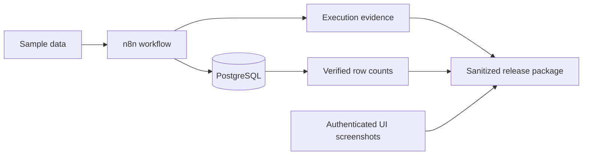

# Local-First n8n Workflow Portfolio

Three verified n8n workflow examples for local automation builders, self-hosters, and reviewers who want to inspect real workflow execution evidence instead of only static exports.

This repository contains sanitized n8n workflows, PostgreSQL schemas, sample data, screenshots, case studies, validation scripts, and application materials. The workflows were executed in a local self-hosted n8n environment and verified through PostgreSQL persistence checks.

## Verified Projects

| Project | Workflow | Verified persistence |
| --- | --- | --- |
| [Job Application Intelligence](job-application-intelligence/README.md) | Import and audit job application data | `job_applications=2`, `job_import_runs=1`, `job_import_rejections=0` |
| [Fleet Operations](fleet-operations/README.md) | Track fleet intake and operation runs | `fleet_vehicles=3`, `fleet_operation_runs=1` |
| [Local AI Knowledge](local-ai-knowledge/README.md) | Process local knowledge documents | `knowledge_documents=3`, `knowledge_processing_runs=1` |

## Architecture



## Repository Contents

- `workflows/`: sanitized n8n workflow exports
- `schemas/`: PostgreSQL schemas used by the workflows
- `sample-data/`: small shareable sample inputs
- `screenshots/`: verified n8n UI screenshots and final-output evidence
- `case-studies/`: evidence-based project writeups
- `docs/`: import, execution, and sanitization notes
- `application/`: n8n application package materials
- `scripts/`: release validation and secret scanning
- `release/`: first-release notes and publication planning
- `evidence/`: reviewer index for evidence artifacts

## Screenshots

| Project | Workflow canvas | Successful execution |
| --- | --- | --- |
| Job Application Intelligence | [Canvas](screenshots/job-tracker/workflow-canvas.png) | [Execution](screenshots/job-tracker/successful-execution-green-nodes.png) |
| Fleet Operations | [Canvas](screenshots/fleet-operations/workflow-canvas.png) | [Execution](screenshots/fleet-operations/successful-execution-green-nodes.png) |
| Local AI Knowledge | [Canvas](screenshots/local-ai-knowledge/workflow-canvas.png) | [Execution](screenshots/local-ai-knowledge/successful-execution-green-nodes.png) |

## Stack

- n8n
- PostgreSQL
- Docker
- Colima
- macOS Apple Silicon
- Local filesystem-backed sample data
- Shell validation scripts

## Features Demonstrated

- Workflow import and execution
- PostgreSQL-backed persistence
- Workflow release sanitization
- Screenshot evidence collection
- Local backup and verification discipline
- Secret scanning
- Reviewer-oriented documentation
- Clear boundaries around local-only evidence

## Local Setup

1. Run n8n and PostgreSQL in your preferred local environment.
2. Apply the schema files under `schemas/`.
3. Create an n8n PostgreSQL credential named `Local n8n Postgres`.
4. Import the workflow JSON files under `workflows/`.
5. Open each PostgreSQL node and select your local credential.
6. Execute the workflow manually.
7. Query PostgreSQL to verify inserted rows.

More detail is available in [docs/IMPORT_GUIDE.md](docs/IMPORT_GUIDE.md).

## Docker and PostgreSQL Notes

This package does not include private local database files or environment values. Use your own local PostgreSQL database, user, password, and host. Do not commit those values.

For n8n file nodes, configure file access narrowly for the sample data path you intend to use. The verified local build used scoped file access rather than broad filesystem access.

## Backup Strategy

The source portfolio used local backup validation before release packaging. Backup archives and private database files are intentionally omitted from this public package. The release includes evidence summaries, schemas, sanitized workflows, and sample data instead.

## Evidence

Evidence is available in:

- [docs/EXECUTION_SUMMARY.md](docs/EXECUTION_SUMMARY.md)
- [evidence/README.md](evidence/README.md)
- `screenshots/*/SCREENSHOT_MANIFEST.md`
- `screenshots/*/final-output-evidence.txt`
- `case-studies/*.md`

The verified UI state was an authenticated n8n session, not a sign-in page.

## Validation

Run from the repository root:

```bash
./scripts/validate-release.sh
./scripts/secret-scan.sh
```

The validation script checks workflow JSON, sample JSON, required docs, and release workflow credential markers. The secret scan checks for common secret, credential, and private-path patterns.

## Limitations

- The data set is intentionally small.
- The workflows were verified locally.
- This package does not claim external usage, live user traffic, uptime, or paid integration usage.
- The Local AI Knowledge workflow uses a deterministic verified path; optional local model experimentation is outside the release evidence path.

## Lessons Learned

- n8n file access restrictions should be explicit and narrow.
- Workflow exports need sanitization before public sharing.
- PostgreSQL row counts are a simple and useful proof of persistence.
- Screenshots and final-output evidence make workflow packages easier to review.
- A release package is stronger when it includes validation scripts, not only workflow JSON.

## Contributing

See [CONTRIBUTING.md](CONTRIBUTING.md). Keep examples deterministic, sanitized, and easy to run locally.

## Security

See [SECURITY.md](SECURITY.md). Do not add `.env` files, database files, backups, credential exports, passwords, tokens, private emails, or private screenshots.
