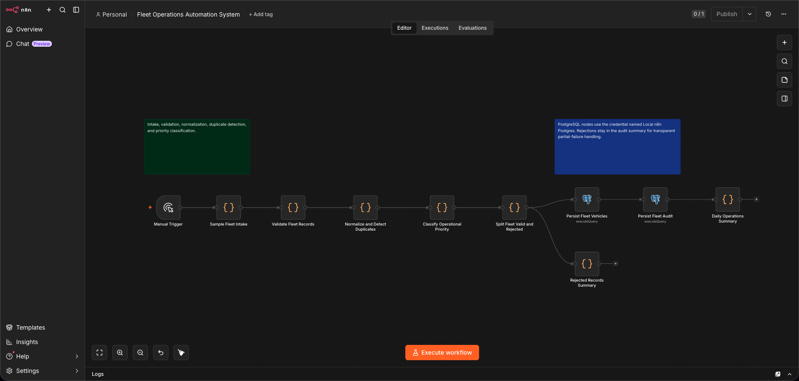
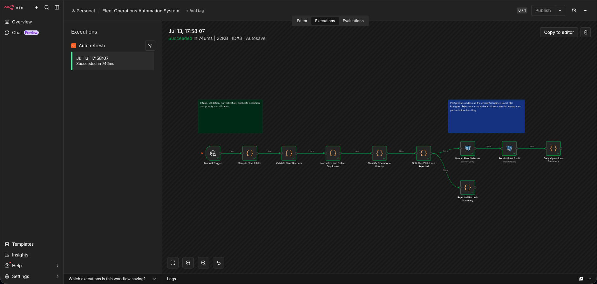

# Fleet Operations Automation System Case Study

## Problem

Fleet operations teams need a repeatable way to turn mixed vehicle intake records into operational priorities while preserving an audit trail. The verified demo avoids customer personal data and focuses on station-ready vehicle state.

## Architecture

The workflow runs in local n8n, uses deterministic sample intake records, validates required fleet fields, normalizes vehicle plates, flags operational risks, persists vehicle state to PostgreSQL, and records each processing run.

## Workflow Sequence

1. Manual trigger starts the demo run.
2. Sample fleet records are generated in workflow code.
3. Validation and normalization nodes enforce required fields and canonical plate format.
4. Priority classification flags high-priority maintenance, damage, and low-fuel cases.
5. PostgreSQL nodes upsert fleet vehicles and insert an operation-run audit record.
6. Final summary nodes return daily operations and rejection summaries.

## Persistence Model

The verified run wrote to:

- `fleet_vehicles`: 3 rows
- `fleet_operation_runs`: 1 row

The latest operation run is `completed`, with 3 records seen, 3 valid, 0 rejected, 0 duplicate candidates, and 2 high-priority vehicles.

## Reliability Patterns

- Idempotent upsert by normalized registration plate.
- Separate operation-run audit table.
- Deterministic sample input for repeatable demos.
- Rejection path retained even though the verified sample had no rejected records.
- Report script verifies persisted state after execution.

## Debugging Performed

No workflow-logic error occurred after the shared local PostgreSQL credential and CLI broker isolation were in place. The same supported import and execution path used for Job Tracker was reused, with credential IDs injected only into temporary runtime import copies.

## Evidence

- Execution summary: `../docs/EXECUTION_SUMMARY.md`
- Workflow canvas screenshot: `../screenshots/fleet-operations/workflow-canvas.png`
- Successful execution screenshot: `../screenshots/fleet-operations/successful-execution-green-nodes.png`
- Final output evidence: `../screenshots/fleet-operations/final-output-evidence.txt`
- Screenshot manifest: `../screenshots/fleet-operations/SCREENSHOT_MANIFEST.md`
- Release export: `../workflows/fleet-operations/fleet-operations-automation.release.workflow.json`

## Screenshots

## Limitations

The verified data set is synthetic and intentionally small, designed to prove workflow behavior and persistence rather than model a full fleet feed.

## Future Roadmap

- Add CSV/file intake for real station exports.
- Add daily exception reports for high-priority vehicles.
- Add optional notification nodes after local approval.
