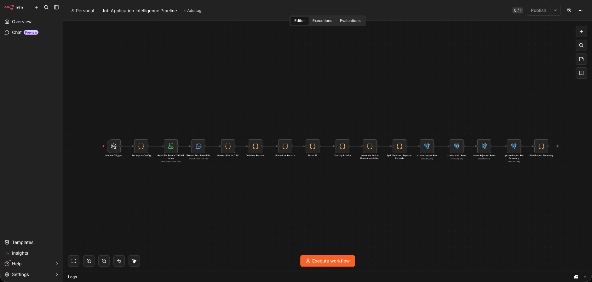
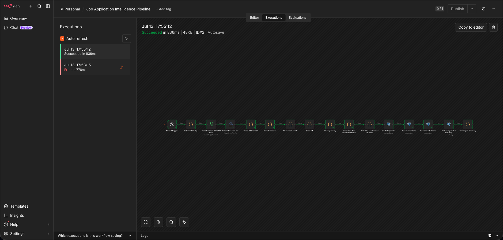

# Job Application Intelligence Pipeline Case Study

## Problem

Job opportunities are easy to collect but difficult to compare consistently. The goal was to turn local job import files into durable, queryable application records with repeatable scoring, clear rejection handling, and auditable import runs.

## Architecture

The workflow runs in local n8n, reads a local JSON/CSV import file, parses and validates records, normalizes fields, scores fit, classifies priority, recommends next action, and persists valid and rejected records to PostgreSQL.

## Workflow Sequence

1. Manual trigger starts the import.
2. A config node selects the local sample file.
3. File read and extraction nodes load the content.
4. Code nodes parse, validate, normalize, score, classify, and split records.
5. PostgreSQL nodes create an import run, upsert valid jobs, insert rejections, and update the run summary.
6. The final node returns an import summary.

## Persistence Model

The verified run wrote to:

- `job_applications`: 2 rows
- `job_import_runs`: 1 row
- `job_import_rejections`: 0 rows

The import run status is `completed`, with 2 records seen, 2 valid, 0 rejected, 2 inserted, and 0 updated.

## Reliability Patterns

- Idempotent upsert keyed by normalized company/title/url.
- Separate import-run audit table.
- Rejection table for invalid records.
- Local-first file intake with explicit n8n file-access allowlist.
- Post-execution reports and backup verification.

## Debugging Performed

The first CLI execution hit n8n task broker port `5679`, already used by the running server. The retry used a CLI-only broker port. The next failure was n8n file-access policy blocking the mounted import path. The fix was a minimal `N8N_RESTRICT_FILE_ACCESS_TO` entry allowing only the default file directory, `/files`, and the existing Job Tracker imports mount.

## Evidence

- Execution summary: `../docs/EXECUTION_SUMMARY.md`
- Workflow canvas screenshot: `../screenshots/job-tracker/workflow-canvas.png`
- Successful execution screenshot: `../screenshots/job-tracker/successful-execution-green-nodes.png`
- Final output evidence: `../screenshots/job-tracker/final-output-evidence.txt`
- Screenshot manifest: `../screenshots/job-tracker/SCREENSHOT_MANIFEST.md`
- Release export: `../workflows/job-tracker/job-application-intelligence.release.workflow.json`

## Screenshots

## Limitations

The sanitized release workflow uses `/files/job-tracker/jobs-import-example.json`; users should either place sample data there or adjust the config node to their own mounted path.

## Future Roadmap

- Add additional source-file templates.
- Add optional human review for borderline scores.
- Add a small dashboard view from the PostgreSQL report queries.
