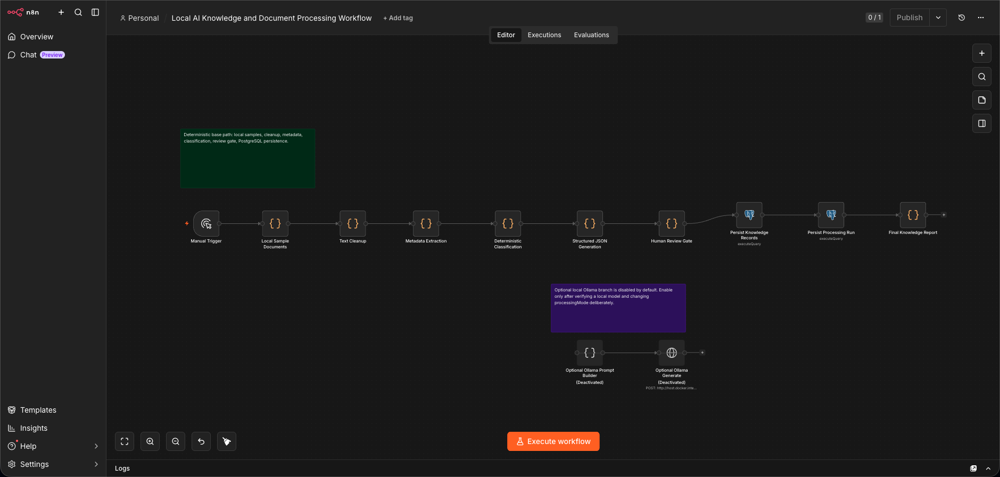
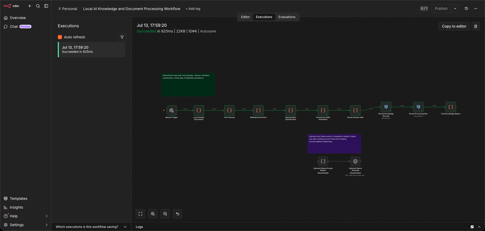

# Local AI Knowledge Workflow Case Study

## Problem

Teams often collect notes, runbooks, and article fragments, but the material becomes difficult to classify, summarize, and review consistently. The goal was to prove a local-first knowledge pipeline with deterministic processing and durable PostgreSQL persistence.

## Architecture

The workflow runs in local n8n, generates local sample documents, cleans text, extracts metadata, classifies documents deterministically, builds structured JSON, applies a review gate, and persists results to PostgreSQL. An optional Ollama HTTP branch exists but is not connected to the verified persistence path.

## Workflow Sequence

1. Manual trigger starts the sample document run.
2. Local sample documents are created inside the workflow.
3. Text cleanup and metadata extraction prepare normalized records.
4. Classification and JSON generation create structured document summaries.
5. A human-review gate marks whether low-confidence documents need review.
6. PostgreSQL nodes persist knowledge documents and processing-run metadata.
7. The final node returns the processing summary.

## Persistence Model

The verified run wrote to:

- `knowledge_documents`: 3 rows
- `knowledge_processing_runs`: 1 row

The latest processing run is `completed`, with 3 records seen, 3 persisted, and 0 requiring review.

## Reliability Patterns

- Idempotent upsert by `document_id`.
- Separate processing-run audit table.
- Deterministic baseline that does not require paid APIs.
- Explicit human-review gate.
- Optional local-model branch kept separate from the verified persistence path.

## Debugging Performed

The workflow executed successfully after the shared PostgreSQL credential and CLI broker isolation were in place. The optional Ollama request node was inspected and confirmed disconnected from the manual-trigger persistence path, so the verified run did not depend on an external API.

## Evidence

- Execution summary: `../docs/EXECUTION_SUMMARY.md`
- Workflow canvas screenshot: `../screenshots/local-ai-knowledge/workflow-canvas.png`
- Successful execution screenshot: `../screenshots/local-ai-knowledge/successful-execution-green-nodes.png`
- Final output evidence: `../screenshots/local-ai-knowledge/final-output-evidence.txt`
- Screenshot manifest: `../screenshots/local-ai-knowledge/SCREENSHOT_MANIFEST.md`
- Release export: `../workflows/local-ai-knowledge/local-ai-knowledge-processing.release.workflow.json`

## Screenshots

## Limitations

The verified run uses deterministic logic only; local model generation can be enabled later after selecting and testing a specific installed Ollama model.

## Future Roadmap

- Add controlled local-model summarization using an installed Ollama model.
- Add document-source folders or file intake.
- Add review queues for low-confidence classifications.
