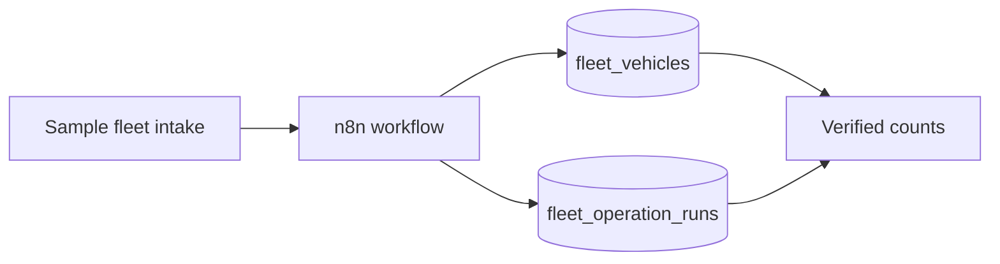

# Fleet Operations Architecture

```mermaid
flowchart LR
  intake[Sample fleet intake] --> workflow[n8n workflow]
  workflow --> vehicles[(fleet_vehicles)]
  workflow --> runs[(fleet_operation_runs)]
  vehicles --> report[Verified counts]
  runs --> report
```

The workflow demonstrates structured intake, PostgreSQL persistence, and operation run tracking.
