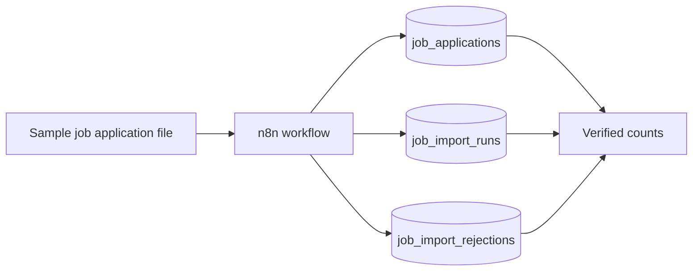

# Job Application Intelligence Architecture

```mermaid
flowchart LR
  input[Sample job application file] --> workflow[n8n workflow]
  workflow --> applications[(job_applications)]
  workflow --> runs[(job_import_runs)]
  workflow --> rejections[(job_import_rejections)]
  applications --> report[Verified counts]
  runs --> report
  rejections --> report
```

The workflow demonstrates local file intake, PostgreSQL inserts, import run tracking, and rejection tracking.
