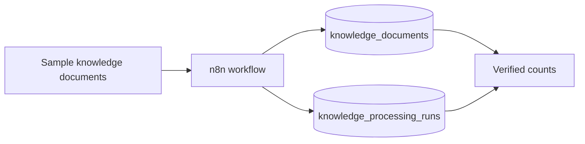

# Local AI Knowledge Architecture

```mermaid
flowchart LR
  docs[Sample knowledge documents] --> workflow[n8n workflow]
  workflow --> documents[(knowledge_documents)]
  workflow --> runs[(knowledge_processing_runs)]
  documents --> report[Verified counts]
  runs --> report
```

The workflow demonstrates local document processing, deterministic persistence, and processing run tracking.
